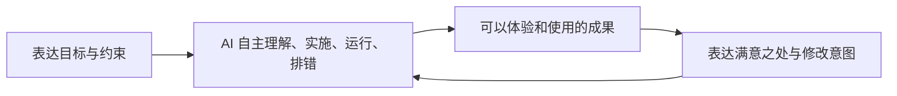

# Chili 产品与架构主线

2026-10-03 最新优先级：**按用户决定，暂缓 UI 与交互扩建，从任务全生命周期打磨底层，不只研究被点名的模块。** 全局复核后，先修执行身份、资源权限和状态归属的不一致：内部调用 ID、跨会话文件观察、规范路径授权、审批政策更新、MCP 目标信任与凭据、同 store 的执行 owner。随后统一会话/工具/模型请求生命周期，在其上完善 Context/Prompt、Memory 和多智能体。已完成的 Host、持久输入和工具执行器继续复用；实现放在共享 core/store/host，CLI、TUI、Desktop 都是入口。具体证据、取舍与验收见 [基础层全局复核](agent-foundation-review-2026-10-03.md)。本条覆盖此前客户端优先及同日早先上下文优先排序，产品最终标准不变。

2026-10-03 基础层实施更新：已将身份与权限、工具准备、实际模型请求、Memory 事务、子代理执行和恢复互斥接入共享 Host/Runtime；同 store 第二 Host 明确拒绝，POSIX 外部进程采用 owner 登记后启动与 guardian 清理。具体实现、兼容迁移、行为证据及尚存限制见 [基础层实施记录](agent-foundation-implementation-2026-10-03.md)。真实模型长期任务能力、跨进程 attach、MCP OAuth 与其他平台等价隔离仍不冒充完成；UI、交互和公开分发继续后置。

2026-09-08，按用户最新纠正重新确定产品前提：**模型能力足够强，默认用户不读代码、不定位实现、不组织代理。** 这是当前产品设计的出发点。本文覆盖此前以开发者读代码、选区反馈为中心的方案；未实现项为计划。

2026-10-01 更新：**当前以用户能将自己的真实日常工作从 Codex/ChatGPT 迁到本地 Chili 为产品标准。** 公开下载、签名、公证、更新渠道与商业分发后置。围绕持续增强的编码智能体打磨极简且完整的客户端，不限定为表格办公，不以一次演示作为完成。用户允许改变架构、语言和框架；取舍以产品收益及迭代效率为依据。共享 Host 的当前实现与迁移边界见 [`@chili/host`](../packages/host/README.md)。

后续完成 Codex、DeepSeek Harness、Pi、OpenCode 的专项研究和独立设计复核，形成 [Host 重设计建议](chili-host-design-2026-10-01.md)：公共装配与执行状态统一，保留现有核心与存储；不引入各参考项目完整框架。批次 A 的公共装配已经归位：CLI 与 Desktop 使用同一 Host 工厂，TUI 沿用 HTTP/SSE，命令展开和工具限制共用逻辑。批次 B 已将持久接纳、提交去重、队列与 Goal 仲裁、停止/恢复接入公共 RuntimeService；桌面读取后端状态，重启恢复要求明确继续并核对未知操作结果。每个 store 一个逻辑 owner，不预先固定每项目一个后台进程。执行 owner 的冲突拒绝与 Memory/Context 基础重构已按本文开头的 2026-10-03 实施记录推进；跨进程 attach 与独立后台生命周期仍未实现。

## 核心承诺

**用户表达想要什么，Chili 自主推进，交付可以使用的结果；用户体验后说哪里不满意，Chili 继续改。**

用户可以持续经营一个项目，也可以同时推进几个目标。项目中的代码、目录、分支、命令和代理调度由 AI 与宿主共同处理。产品不能依赖用户懂这些概念才能开始或继续。

核心流程是：

用户说“这个流程太长了，简化一下”，AI 应自行理解当前成果、观察行为、找到实现位置并修改。用户无需先指出文件、代码行或页面元素。主动提供图片、资料或具体位置可以作为辅助，不能成为正常流程的必经步骤。

## 桌面应该围绕什么展开

主要对象是**持续演进的项目与成果**。任务负责承载一次目标及其执行，不应成为要求用户维护的工程管理表格。

用户进入项目，首先能接触当前可用结果、了解正在推进的目标，以及确实需要自己决定的事情。对话承载目标、偏好、约束与反馈；运行过程在必要时展开。已有代码、diff 和日志保留为内部工作工具与按需细节。

“可以使用的结果”随项目而变：可以是运行中的应用、可访问的服务、可执行的程序，或者生成的文件。默认入口应帮助用户使用或体验成果。后台功能也需要给出清楚的使用方式，不能用一段“已完成”的聊天替代交付。

用户决定产品偏好、业务规则、优先顺序和授权。搜索资料、定位问题、组织上下文、选择实现步骤、调用工具和协调子代理由 AI 承担。问题确实无法从上下文推断时，再提出具体问题。

## 当前架构中真正值得推进的缺口

现有多项目 runtime、历史、Goal、Queue / Steer / Stop、工具执行和统一 Agent 继续复用。Agent 以 Session 为身份，共用持久输入队列。按新的产品前提，优先级如下。

| 当前接线 | 对自主工作的影响 | 演进方向 |
| --- | --- | --- |
| [顶层任务](../apps/desktop/src/main/control-service.ts:743) 一律以项目 cwd 创建，[创建参数](../apps/desktop/src/shared/contracts.ts:138) 没有任务工作区绑定 | 多项独立写任务仍共用代码现场，成果与执行目录的归属不完整 | 宿主为任务分配并记录明确的工作区；常规路径自动选择资源策略 |
| [RuntimeService](../packages/core/src/runtime-service.ts) 已负责持久输入与 Queue / Steer / Stop；[Host 说明](../packages/host/README.md#durable-session-inputs) 记录恢复边界 | 输入可跨重启保留，但尚无跨进程控制转发及独立驻留 | 验证真实日用恢复，再接最小 owner attach 与成果入口 |
| 当前桌面主要围绕 Timeline、Activity 与 Changes 展开，见 [App](../apps/desktop/src/renderer/App.tsx:1246) | 用户容易停留在阅读执行记录，难以直接进入当前成果 | 任务关联可用成果和运行入口，逐步将体验、自然语言反馈与继续执行接通 |
| [Diff 查询](../apps/desktop/src/main/control-service.ts:711) 固定读取项目目录；权限配置也是项目级状态 | 执行位置、成果观察与配置作用范围尚未统一到任务 | 明确项目身份、任务工作区和有效执行配置，让所有操作跟随同一归属 |

DiffViewer 缺少选区操作不再被列为当前产品缺口。代码选区、行内反馈和引用卡从优先实施计划撤下。

## 三条建设主线

### 1. 让 AI 拥有能够自主工作的运行环境

AI 应能读项目、修改文件、安装项目所需依赖、启动程序、取得运行句柄、观察输出与错误，并在授权范围内操作和检查成果。模型决定何时使用这些能力，宿主提供清楚、稳定的执行接口。

对有界面的项目，自主观察与操作运行中的界面应优先于要求用户截图、圈选或定位。对服务和命令行项目，则提供相应运行、调用和输出检查能力。并非所有项目都需要内置浏览器。

进程、端口、日志、运行入口和工作目录必须有归属。多任务并行不能靠用户管理一组终端窗口；任务结束、停止或恢复时，宿主能处理它拥有的资源。

### 2. 让成果能够被体验、继续修改和恢复

把当前成果与产生它的任务、执行、工作区关联起来，给用户稳定的打开或使用入口。不同版本与进行中的修改应保持清楚，避免用户反馈一个版本，AI 却在另一份目录修改。

用户可以补充目标、调整优先级或描述不满意之处。系统接住这些意图，由 AI 自行定位并续做。是否需要中断、排队或在合适边界继续，应有一致的宿主语义。

目标、约束、已作决定、已接受的输入、当前成果和实际执行状态需要持续保留。恢复时由 AI 重新核对现场，减少用户整理材料和重述历史的负担。进程重启后的恢复与关闭应用后持续运行是不同能力，常驻运行模式另行设计。

### 3. 让并行成为 AI 的执行能力

用户提出几件想完成的事，模型负责拆分、协调和整合。宿主提供统一 Agent 的创建、消息、等待、停止与恢复，使用 Session 和持久输入队列记录身份与执行状态。worktree 操作通过 Bash 执行，补丁应用由独立工具提供。

普通使用不要求配置专家角色、工作流图或并发数。界面主要呈现目标进展、可使用成果及确实需要人的决定。已有代理详情可以保留为按需工具，其扩建不占据主线。

## 架构边界

当前建议复用 Bun / TypeScript、SQLite、Electron / React、现有工具与 provider 包，以及每项目 sidecar；这些不是不可修改的约束。有测量或使用证据证明替换更有利时，可以调整。

- **项目**保存长期目标背景、规则、配置来源与项目身份；身份不能等同于当前执行 cwd。
- **用户任务与执行**记录本次目标、后续意图、有效配置和执行状态。先复用现有 root Session，按具体行为补足绑定与执行身份。
- **宿主**拥有任务工作区、持久输入、进程与运行资源、子任务归属、成果入口和恢复能力。
- **模型**理解意图、阅读与观察、制定并调整计划、实施、排错和委派。
- **桌面**组织项目与成果，接收自然语言反馈，展示进度和需要用户决定的事项。

共享输入与控制契约经 server / SDK 提供，执行行为归 core，耐久状态归 store。Desktop main 继续负责本机和窗口适配，业务队列已移入共享 RuntimeService，公共装配已归入 host 包。下一步依据实际日用缺口继续接通能力。

代码和输出的来源、版本、权限及范围仍由内部协议准确记录。这些机制支持 AI 自主获取上下文，不需要先做一套让用户管理引用的界面。

## 2026-09-08 实施记录与原顺序

下列记录保留当时范围与已完成工作。后续建设以 2026-10-01 的产品标准和 [`@chili/host` 的迁移边界](../packages/host/README.md#current-migration-boundary) 为准，覆盖共享 Host、Memory/Prompt、工具/MCP、完整桌面交互及持续使用。

遵循**大道至简**：先补 AI 当前无法完成的具体动作，再从实际使用中决定下一步。模型负责判断与排错，宿主提供少量可组合的工具；不先搭完整环境平台、工作流引擎或新的抽象层。

**第一步：让已经启动的程序保持运行，AI 能在后续步骤检查和停止它。** 已在现有 Bash runner 上加入受管理的后台运行，沿用进程组清理、沙箱和权限路径。AI 获得运行句柄，后续通过一个 process 工具读输出、检查状态或停止程序。普通回复保活，明确停止、归档和宿主关闭时清理。见 [实现与边界](managed-processes.md)。

**第二步：完成“提出目标 → 得到可体验成果 → 用一句话要求继续修改”的流程。** 从一种现有项目类型做通。用户全程无需打开代码或帮助 AI 定位问题；页面反馈也不以选中元素为前提。检查的是产品接线和软件行为，不开展模型能力排名。

**第三步：根据使用中暴露的中断点补持续性。** 例如已接受的输入丢失、运行成果找不到、并行修改互相覆盖，再分别补持久输入、成果入口和任务工作区。复用现有能力，避免把完整宿主重构作为第一条运行链路的前置条件。

当前不安排模型跑分、代码选区反馈、角色市场、DAG 编辑器或完整 IDE 建设。已有可靠性修复与常规软件测试继续作为工程底座。

## 2026-09-08 实施范围

本轮实现第一步，并使用真实本地 HTTP 服务验证跨轮次运行、读日志、修改和再次调用，以及停止、归档和关闭清理。模型输出由测试脚本驱动，未调用付费 Provider。桌面浏览器观察、可体验成果入口、跨宿主重启恢复仍为后续工作。此前的源码研究仍可作为现状证据；其中以读代码的开发者、选区反馈和人工代理管理为中心的优先级，由本文覆盖。
