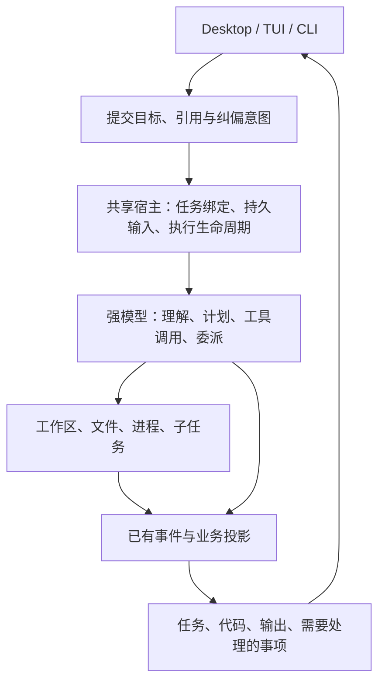

# Chili 产品与架构主线

2026-09-08，依据用户最新指示重新确定优先级。以模型能力足够强为设计前提，模型排名、解题率实验和 coding benchmark 不作为当前工作主线。本文描述接下来的产品方向，未实现项均为建议。

## 核心承诺

**打开已有项目，直接和 agent 把改动做到满意；切去做别的，回来还能接着干。**

首要用户是同时维护几个项目、会读代码并会亲自调整实现的开发者。首要场景是已有仓库中的持续修改：读项目、改代码、运行、看结果、指出具体问题、继续修改；过程中可以并行推进另一项工作。产品围绕这条日常流程展开。

Chili 应替用户承担三种具体负担：描述自己正在看什么、搬运执行所需资料、切换后重新找回工作现场。桌面的价值体现在文件、代码差异、输出与运行结果能直接参与工作。

对话仍然适合表达目标和讨论取舍。任务是组织工作的位置，代码、diff、输出、预览与对话可以在同一任务里展开。用户正在阅读的内容应保持稳定，后台代理不抢走焦点。无需预先规定聊天或编辑器永远占据中央。

## 当前代码告诉我们什么

Chili 已有多项目后台 runtime、Queue / Steer / Stop、任务历史、Goal、代理树和 diff。下一阶段应连通这些资产。

| 当前事实 | 用户仍需付出的操作 | 下一步 |
| --- | --- | --- |
| [DiffViewer](../apps/desktop/src/renderer/DiffViewer.tsx:6) 只有展示参数；[发送契约](../apps/desktop/src/shared/contracts.ts:216) 只有 text 和 mode | 看见具体代码后复制路径、行号、片段，再打字描述 | 选择代码或差异，直接作为引用发给模型 |
| [创建任务](../apps/desktop/src/main/control-service.ts:743) 使用项目 cwd；[创建参数](../apps/desktop/src/shared/contracts.ts:138) 没有工作区起点或隔离选项 | 同项目开多个聊天后，仍须自己判断谁在改哪个目录 | 顶层任务绑定自己的执行目录、基线及成果去向 |
| [Diff 查询](../apps/desktop/src/main/control-service.ts:711) 固定使用项目目录 | 将来任务隔离后，界面可能仍显示另一份目录的变动 | 文件、diff、运行和反馈统一跟随任务绑定 |
| [DesktopControlService](../apps/desktop/src/main/control-service.ts) 在 Electron main 管理内存队列与 Steer；[桌面架构](desktop-architecture.md) 明确队列与草稿退出后不恢复 | 用户要记住哪些输入已经接受、哪些工作需要补发 | 宿主持久保存输入与执行状态，界面保存视图与草稿 |
| [代理详情](../apps/desktop/src/renderer/AgentDetailsPanel.tsx:19) 主要展示数据 | 想纠正某一路代理时，回主聊天重新解释目标对象 | 按需展开子任务，直接补充、停止、继续或打开其改动 |

权限档位目前也是项目 runtime 的可变全局状态：[修改入口](../apps/desktop/src/main/control-service.ts:581)。任务独立性需要覆盖实际执行配置；界面不能把全局变化包装成只影响一个任务的设置。

## 三条产品主线

### 1. 用户能直接指给模型看

选中一段代码、某个 diff hunk 或一段错误输出，写“这里保留旧接口，只调整边界处理”，即可发送。模型收到准确的对象和当时内容；用户不用手工拼路径与行号。

用户也可以只说目标，让模型自行搜索、阅读和定位。对象引用用于表达用户当下的具体意图，不把资料收集工作转交给用户，也不要求每次发送前手动配齐上下文。

第一步用现有 Changes 面板打通。随后沿同一机制接入文件、现有工具输出、图片及技能提及。可运行页面的预览与反馈在需要时接入，不先建设完整浏览器或编辑器体系。

引用的最小信息包括任务与工作区、来源类型、路径或输出 ID、范围、当时内容及内容版本。输入框以简洁引用卡显示；来源元数据留给宿主使用。旧引用仍能说明用户当时看到什么，不能随着文件变化悄悄指向另一段代码。

同一引用机制也可用于委派。主模型选择要给子代理哪些资料，宿主负责传递、读取与范围约束。无需默认复制整个父会话，也不要求用户手动维护代理上下文。

### 2. 每个任务拥有明确的工作现场

一个任务应能回答：当前目标是什么，在哪份代码上工作，打开了什么，运行了什么，下一次输入会交给谁。

Git 仓库中的独立写任务提供 worktree 隔离；继续当前工作时保留在现有目录执行的入口。只读任务可以共享代码，非 Git 项目明确按实际目录工作。不能把隔离宣传成适用于一切资源的保证。

任务绑定至少包含项目身份、执行目录、工作模式、起点和预期集成位置。工具、diff、预览和后继任务共同使用这份绑定。项目身份独立于 cwd，避免换到 worktree 后项目规则、技能和记忆失去归属。

切换任务应恢复选中的文件或结果、草稿和必要的运行入口。任务列表突出工作进度、需要用户处理的事项与新结果；点击通知直接回到对应任务。模型参数保留在易访问的设置里，主要页面优先展示正在做的工作。

### 3. 并行推进工作，按需介入代理

用户并行管理的是几个真实目标：推进功能、处理另一个问题、让一路代理查资料。任务内部是否拆分、拆给谁、开几路、何时整合，由模型结合工作判断。

Chili 提供创建、消息、等待、停止、继续、工作区与产物引用这些稳定能力。界面默认呈现贡献、阻塞和需要人的决定；要追细节时再展开代理。针对子任务的直接操作必须复用原有 ownership、租约和执行边界。

测试、diff 与检查结果继续存在于做东西的流程里。当前不扩建验收仪表盘，不将用户的主要角色设计为逐项审批代理报告。

## 架构随这三条流程收拢

保留 Bun / TypeScript、SQLite 事件与投影、Electron / React、现有 provider 和工具包，以及每项目 sidecar。现有共享宿主已经在 CLI harness 中组装；提取模块应跟随具体功能迁移。

具体边界：

- **Project**：仓库或目录身份、共享规则、配置来源。
- **Workspace binding**：这项工作实际读写的目录和 Git 起点。不能再用“cwd 等于项目根目录”判定任务属于哪个项目。
- **用户任务**：目标、对话和上述绑定。现有 root Session 可继续作为承载，不先另造一套重复任务系统。
- **Execution**：一次输入被接受后跨多个模型 turn 的执行，有可查询的身份和状态，记录本次有效的模型、工具与权限配置。项目默认值与任务覆盖范围明确。与一个工具调用、一个子代理 run 分开。
- **子任务**：模型委派的执行单元，继承明确的资源范围和上下文引用，复用现有 Task / Run / lease 机制。
- **视图状态**：打开的文件、选区、面板、滚动位置归界面；已接受消息、运行状态、任务绑定归共享宿主。

模型决定计划、阅读范围、工具选择与委派方式。宿主保证引用能找到正确资料、操作落在正确目录、输入不丢、取消和结果有明确归属。不会把这些运行条件改写成一套限制模型的固定长流程。

`packages/server` / SDK 负责共享控制与查询契约，`core` 负责执行行为，`store` 负责耐久状态。Desktop main 继续拥有窗口和本机资源适配，逐步移出业务队列。`packages/host` 在共享组装边界清楚时再提取；它不是第一项产品改动的前置工程。

## 下一批的实施顺序

### 第一条可完整使用的流程：在 Changes 里直接反馈

1. 选择某个文件的几行差异，生成带来源和版本的引用卡。
2. 输入修改要求，沿现有普通发送 / Queue / Steer 入口送出。
3. 宿主将引用解析为模型可读取的上下文，并在消息历史保留当时片段。
4. 从该反馈直接回到关联文件，查看后续修改与相关输出。

这条流程先在现有任务上完成，引用从第一版就带任务及工作区身份。软件验证只检查引用准确、忙碌时不丢、跨任务不串、历史可回读等行为，不引入模型能力对照实验。

### 第二条：顶层任务的代码归属

增加任务工作区绑定，贯穿创建、列表归属、工具 cwd、diff 和结果去向。普通用户任务也能用隔离 worktree，复用已有 Git 与团队产物机制；不另写第二套合并实现。保留旧 Session 在原项目目录继续工作的兼容路径。

这项架构设计可与第一条并行。工作区归属完成后，再扩大同项目多个写任务的默认并行体验。

### 第三条：持续工作与并行操作

将被接受的输入、队列与纠偏状态移入共享宿主，恢复任务界面现场；接通通知到具体任务和已有子任务控制能力。然后按实际工作所需补充任务拥有的持久运行进程、终端或预览入口。

现阶段不预设云平台、角色市场、可视化 DAG、完整 IDE、向量检索平台或后台常驻 daemon。模型评测基线留作已有工具，不安排后续跑分工作。已完成的可靠性修复继续作为正常工程底座。

## 本轮产出边界

本轮重新阅读了当前源码，并行进行了桌面流程、宿主架构、上下文协作与产品反方四路分析。没有新查竞品宣传、调用 Chili 的模型 Provider、跑能力评测或修改产品源码。原有桌面未提交改动保持原状。

本地详细研究记录位于 `/tmp/chili-rethink-2026-09-08/`；上面的产品选择是设计判断，源码链接用于证明当前接线与缺口。
