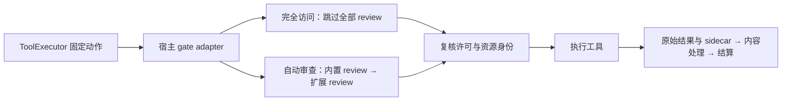

# 宿主模块与 Hook

Chili 通过 `createChiliHost({ modules, onHookError })` 注册进程内模块。
一个模块可以同时提供提示词、工具、模型、Agent、运行事件和模型选择能力。
宿主统一装配，执行器、运行时和存储仍分别负责执行边界、运行结算和事件提交。

## 注册

`HostModule` 使用唯一 `id`，在 Host 构造时一次性注册。内置模块先于传入的模块，
同类能力按注册顺序调用。`chili.` 前缀保留给内置模块；重复 ID、未知能力和无任何
能力的模块会被拒绝。修改原始模块对象不会替换已捕获的回调。

```ts
import { createChiliHost, type HostModule } from "@chili/host";

const completedRequests: string[] = [];
const diagnostics: string[] = [];

const integration: HostModule = {
  id: "integration.context-and-results",
  timeoutMs: 15_000,
  prompt: {
    collect(context, signal) {
      signal.throwIfAborted();
      return [{
        id: "integration.task-context",
        layer: "contextual_user",
        source: "runtime",
        priority: 80,
        lifecycle: "turn",
        trust: "user",
        content: `Integration context for ${context.agentKind}.`,
      }];
    },
  },
  tools: {
    async processResult(_context, result, signal) {
      signal.throwIfAborted();
      return { ...result, output: result.output.replace(/\r\n/g, "\n") };
    },
  },
  model: {
    ended(outcome) {
      completedRequests.push(outcome.context.requestId); // 同步观察
    },
  },
};

const host = await createChiliHost({
  cwd: workspacePath,
  modules: [integration],
  onHookError({ moduleId, point, error }) {
    diagnostics.push(`${moduleId}:${point}: ${error.message}`);
  },
});
```

这是可信 TypeScript 代码的内部组合接口，不是插件加载器。它不加载仓库脚本、
模型生成的代码或 shell Hook，也不提供动态注册、优先级、`next()` 或执行包装器。
回调不能接管、重放或重试工具及模型请求；超时也不是隔离任意代码的沙箱。

## 能力与职责

| 能力 | 调用和结果 | 失败与取消 |
| --- | --- | --- |
| `prompt.collect(context, signal)` | 串行收集提示词片段，复制后进入现有组装器 | 异常或超时终止组装；任务取消和 Host 关闭取消等待 |
| `tools.review(request, signal)` | 对冻结动作返回 `allow` / `deny`，可提供 `assertCurrent` | 首个拒绝终止审查；异常、无效结果或超时阻止执行 |
| `tools.processResult(context, result, signal)` | 串行处理已执行结果的 `title`、`output`、`content` | 普通错误或超时保留成功执行事实与原始结果，并附说明；任务取消按执行器规则结算 |
| `tools.ended(outcome)` | 工具调用结算、释放并发许可后同步观察 | 错误隔离，不改变已执行动作或终结结果 |
| `model.started(context)` / `model.event(context, event)` / `model.ended(outcome)` | 同步观察一次模型流调用及终结 | 错误隔离，不改写流或新增请求、重试 |
| `agent.started(context)` / `agent.ended(outcome)` | 同步观察一次已开始的输入运行及结算 | 错误隔离，不接管调度、租约或资源清理 |
| `runtime.event(event)` | 同步观察现有公开事件，可用 `eventTypes` 过滤 | 错误隔离，不撤销提交；事件也包括实时增量 |
| `modelSelection.changed(input, signal)` | 已提交模型选择的完成工作；内置保存先执行，随后等待扩展 | Host 关闭不取消；仍受单次时限约束。失败传播，已提交选择不回滚 |

执行器负责固定动作、复核许可、执行工具、保存原始结果并结算。运行时负责输入
队列、运行许可、取消和租约释放。存储负责提交边界及实时通知。模块注册器负责
固定顺序、数据副本、时限、错误命名和观察者隔离，不建立另一套调度器或事件总线。

## 提示词与上下文

根与子 Agent 共用模块清单。`prompt.collect` 上下文包含 `sessionId`、`cwd`、
可选 `turn` 和 `agentKind: "root" | "child"`，signal 单独传入。内置模块提供
根／子 Agent 上下文、委派说明和执行审查说明。

输入是冻结副本，每个贡献者的结果先复制，再交给后续处理。不同模块不能产生
相同片段 ID，扩展不能覆盖内置说明；同一贡献者内部既有的重复片段仍由原
`PromptAssembler` 处理。片段来源、权限层级、选择和预算沿用原机制，模块不能
直接改写最终模型请求。

提示词预览也调用贡献者，所以它们应只提供材料，不产生业务副作用。真实任务的
signal 随 Stop 等取消；预览仍受模块时限和 Host 关闭约束。Memory 继续通过已有
上下文快照进入提示词，使用原有读写接口。这次模块化不增加自动更新 Memory、
自动提取记忆或后台维护接口。

## 强制审查

`chili.execution-review` 是正式注册的内置模块，同时提供审查说明
`prompt.collect` 和自动审查 `tools.review`。Host 必须装配它，缺失时不能建立
执行 gate。扩展可以增加审查能力，但不能用自己的 `allow` 替换内置审查。



完全访问跳过所有模块的 `tools.review`，但保留设置 revision、取消和调用身份的
许可复核。自动审查依次调用所有审查能力，只有全部允许才能执行；拒绝不会被
后续允许覆盖。所有允许结果的 `assertCurrent` 保留并在副作用前复核，模式或
审查说明改变后旧许可失效。

内置审查仍是独立、无工具的模型请求，没有只读调查 Agent 能力。用户只有
`full-access` 和 `auto-review` 两种模式，可修改审查说明和选择审查模型。
普通调用、`code_mode` 子调用、子 Agent 与 MCP 工具均由执行器强制进入 gate。
详见[工具执行与自动审查](../../docs/tool-execution-review.md)。

## 工具结果与执行事实

`tools.processResult` 在工具成功返回、原始结果规范化和 sidecar 处理完成后运行。
只有 `title`、`output`、`content` 可以改变；`structuredData`、`metadata` 和
`artifactIds` 始终取自规范化的原始结果。处理后的内容再次经过类型和大小校验。
处理器不能伪造执行元数据或 artifact 路径，也不会再次执行工具或重复保存 sidecar。

返回给调用方的 `result` 包含处理后的呈现，`tool.call_finished` 审计输出保留
原始内容。`tools.ended` 同时提供 `canonicalResult`、`result`，以及
`handlerEntered`、`executionSucceeded`、`phase`、`status` 和可选错误。
它覆盖 Runtime 预检失败、工具不可用、循环保护拒绝、流式调用未完成、取消和
执行失败。尚未执行的调用也通过执行器记录一次审计终态和通知，且不进入审查或
handler。终结状态本身不能证明副作用没有发生。

内容处理失败且任务未取消时，执行器保留成功结果，明确提示“执行成功，内容处理
失败，不应仅因此重跑工具”。真实任务取消仍可能发生在副作用之后，应结合上述
执行事实判断，不能把取消当作回滚。

## 模型与 Agent 生命周期

模型生命周期对应一次调用路由器 `stream()` 并消费其流的尝试，不等同于用户的
一次输入，也不保证对应一次底层 HTTP 请求。每次调用有独立 `requestId`，
保留会话、轮次、时间及用途。运行时重新调用模型会产生新的生命周期；provider
内部重试、截止时间、流式背压和连接清理沿用原实现。

`purpose` 为 `task`、`review`、`compaction` 或 `validation`。
Host 的 `agentRole` 表示发起会话属于 `root` 还是 `child`，子会话保留
`parentSessionId`。用途与身份是两个维度：子 Agent 的审查请求同时是
`purpose: "review"` 和 `agentRole: "child"`。上下文解析失败会报告诊断，
用 `unknown` 表示无法确认的身份。

`model.ended` 在流自然结束、finish、错误、取消或消费者提前退出时结算一次，
提供状态、终止原因及可用的用量。提前停止消费仍会关闭 provider iterator。
用量按 provider response 的累计快照合并，不把每次 usage 通知当作新增 token。

Agent 生命周期对应一次实际开始运行的 accepted input，包含内部多个模型和
工具轮次。排队等待不等于已开始。`agent.ended` 在运行结算、释放租约之后、
Host 关闭完成之前发出，提供运行与输入身份、根／子角色、状态和 `turnCount`。
手动压缩有模型生命周期，不伪造新的 prompt Agent 运行。

## 公开事件与同步观察者

`runtime.event` 和旧 `onEvent` 接收 `compactRuntimeEvent` 处理后的公开事件，
旧入口只适配一次。持久事件成功写入后才通知；`tool.output_delta`、
`message.part_stream_delta` 等实时增量不持久化，整个通道并不是可重放的提交历史。

`model.event` 是内部模型流观察，包含审查、压缩等请求的流数据。注册它不会把
这些内容追加到公开事件、SSE 或会话历史。回调看到冻结副本，不能改变 provider
原始事件，也不改变流的消费次序与背压。

所有 `started`、`event`、`ended` 观察者必须同步返回，不被 `await`。
返回 Promise 会被诊断并停用该能力，拒绝会被捕获。普通异常也只停用对应
`moduleId + point`，同模块其他能力仍有效，尤其不会卸载其审查。
`onHookError` 提供冻结的 `moduleId`、`point`、`error` 副本，诊断不能改写原始
失败分类，诊断自身异常不递归传播。未订阅模型流时不会安装原始流事件回调或
复制每条增量；未订阅对应终结观察时也省去观察快照。

## 时限、关闭与完成工作

可等待能力按模块 `timeoutMs` 限时，默认 30 秒，允许 1–60,000 毫秒。
内置审查模块使用 60 秒，审查服务的 `reviewTimeoutMs` 也继续生效，以先到的
截止时间为准。每个 handler 和许可复核分别计时，不是整个输入的总时限。

Host 开始关闭时停止准入，取消 prompt、review、结果处理等可取消等待，运行时
和执行器继续负责结算。观察者仍接收终结与关闭事件，直到最终取消订阅。

`modelSelection.changed(input, signal)` 用于已提交设置变更的必达完成工作。
signal 不因 Host 关闭而取消，但仍在 handler 超时时中止。即使同步事件观察者
在 `session.model_changed` 提交后立刻关闭 Host，内置默认模型保存也会启动。
Host 跟踪并等待已启动的原子写入，再关闭存储、释放 owner，避免旧宿主的迟到写入
覆盖新宿主。失败报告给调用者，不撤销已提交设置。

扩展可等待回调必须 `await` 自己启动的全部工作，并遵守 signal，在取消或超时
时停止后续副作用。宿主不能强杀任意 JavaScript，也不替扩展追踪脱离回调的 I/O。
完成能力不是持久任务队列，没有新增崩溃重放、自动重试或 exactly-once 副作用保证。
